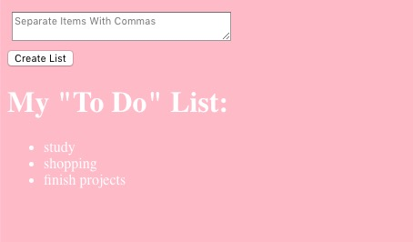

# A simple todolist website
This project use react to create simple todolist, have another version more complicated todolist with express as backend

## Available Scripts
In the project directory, you can run:

### `npm start`
start the application

